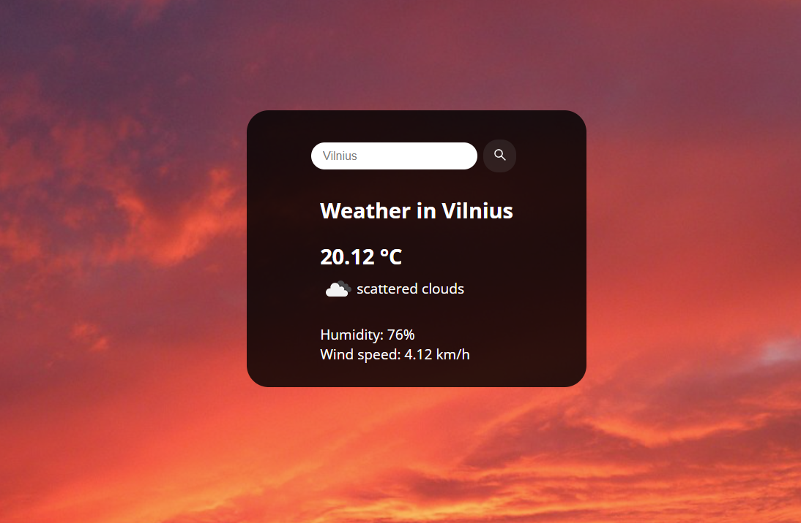

# 🌦️ Weather App

A simple JavaScript weather application that fetches real-time weather data using the **OpenWeatherMap API**.

## 🔍 Features

- Search for any city and get current weather details:
  - 🌡 Temperature in Celsius  
  - 🌬 Wind speed  
  - 💧 Humidity  
  - 🌥 Weather description and icon  
- Basic error handling (alerts user if the city is not found)

## 🧪 Technologies Used

- **JavaScript (ES6+)**
- **HTML/CSS**
- **OpenWeatherMap API**

## 📸 Preview





## 🚀 Getting Started

### 1. Clone the repository

```bash
git clone https://github.com/yourusername/weather-app.git
cd weather-app
```

### 2. Open `index.html` in a browser

No need for a server. It's a pure frontend app using JavaScript.

## 🔑 API Key

This project uses a public weather API from [OpenWeatherMap](https://openweathermap.org/api).  
You can use the provided API key in this demo or get your own for free:

```js
const weather = {
  apiKey: "e14f135ff04a40d618f3ce5fb6ddc3fb", // replace this with your own key if needed
  ...
};
```


## 📁 File Structure

```
/weather-app
├── index.html
├── style.css
└── script.js  # Contains the weather logic
```

## 📄 License

MIT — free to use and modify
